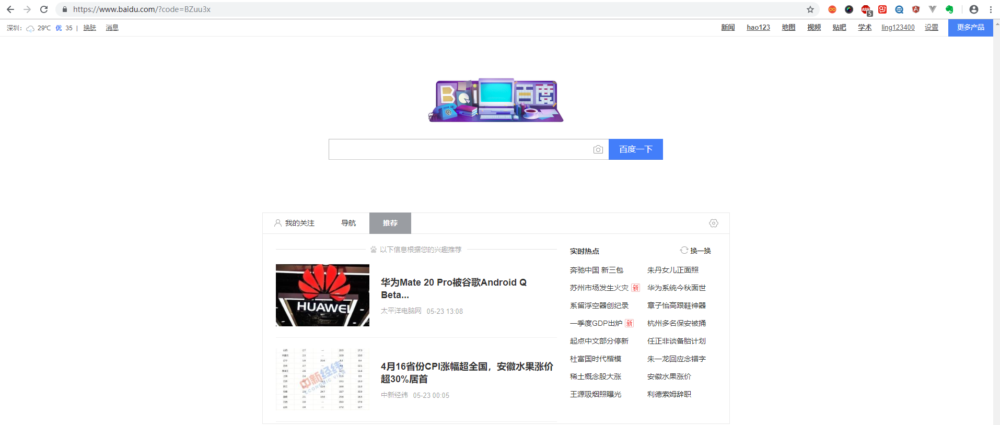
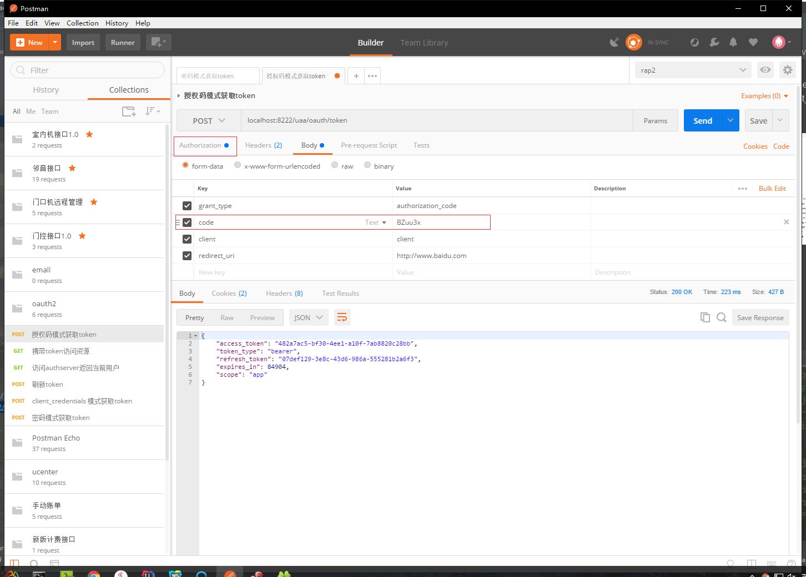
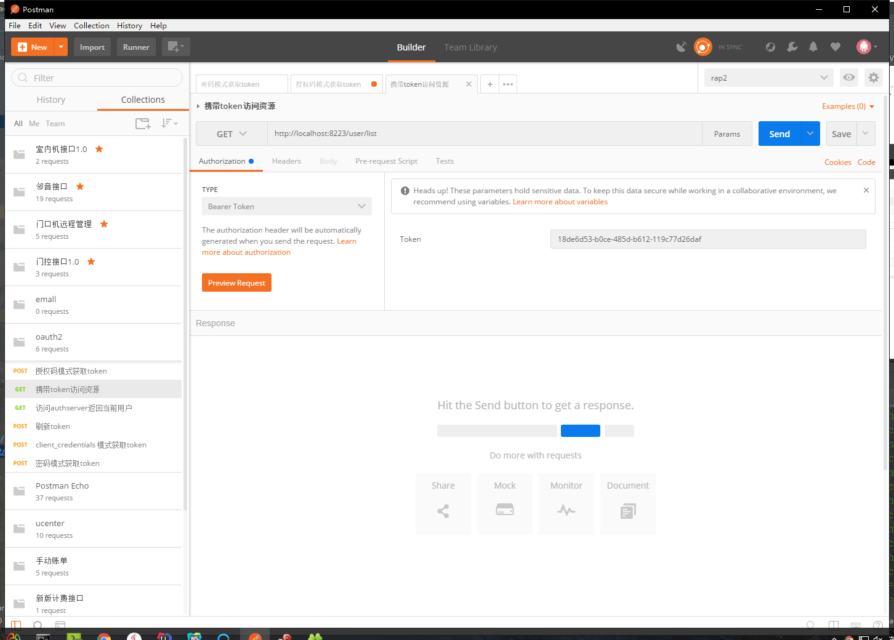
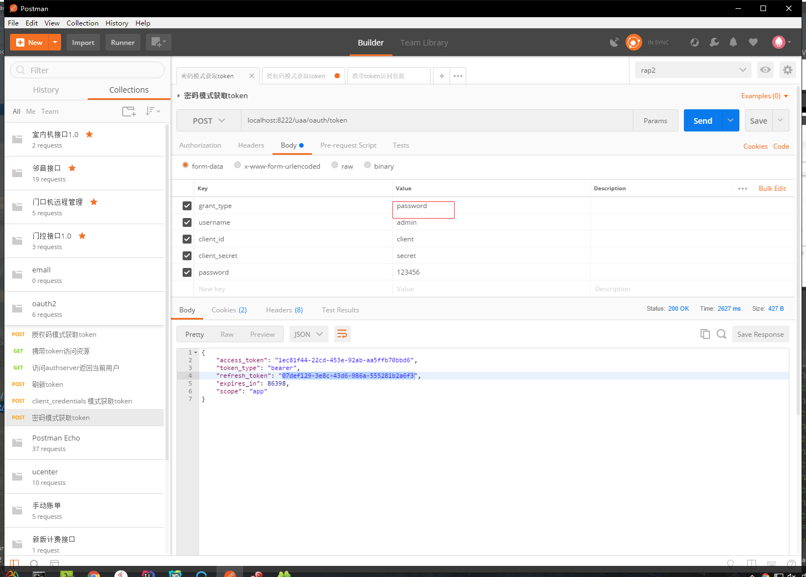
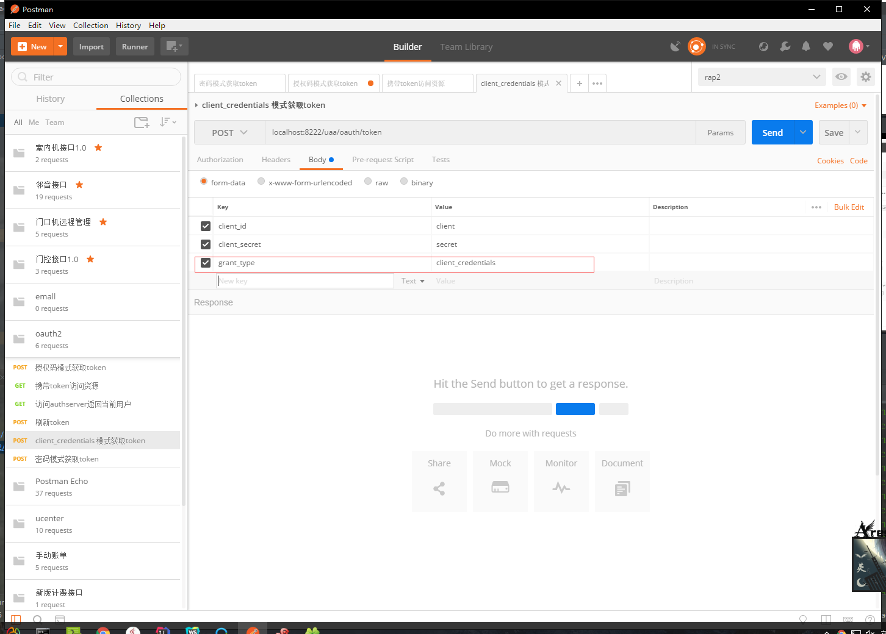
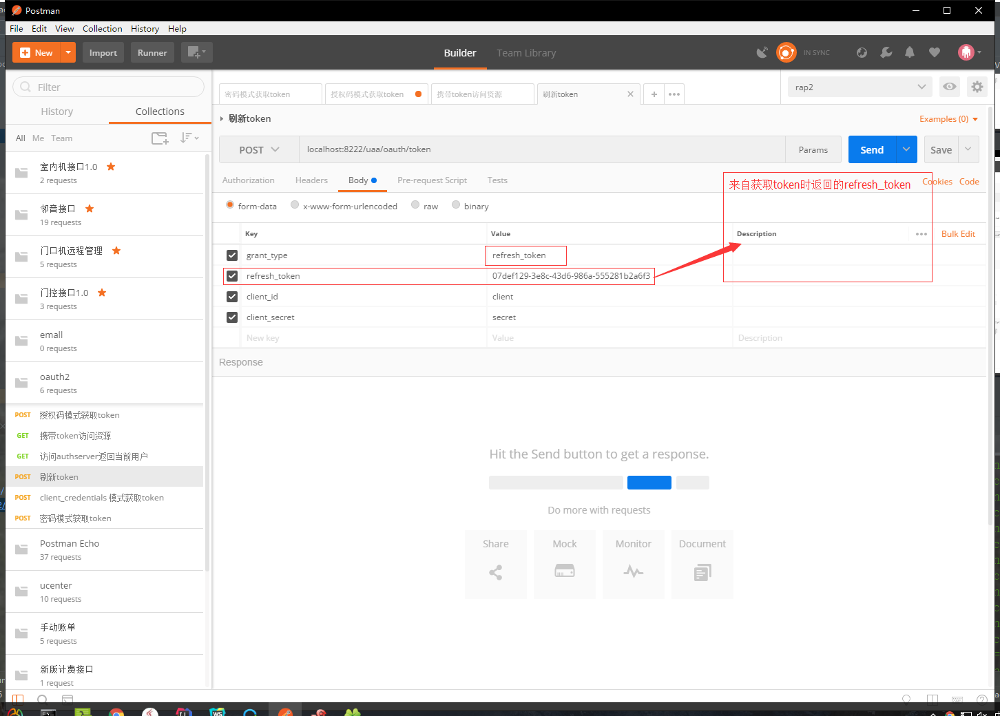

一、授权码模式(authorized_code)  
1:获取code(localhost:8222/uaa/oauth/authorize?client_id=client&response_type=code&redirect_uri=http://www.baidu.com)  
2:返回如图
3:使用返回的code请求token
4:携带token访问资源  
  
二、密码模式(password)  
1:获取token
2:携带token访问资源  
  
三、client_credentials模式
1:获取token  
2:携带token访问资源  

四、implicit模式
1、直接请求http://localhost:8222/uaa/oauth/authorize?response_type=token&client_id=client&redirect_uri=http://www.baidu.com
2、返回登录页面，使用注册的账号密码登录。
3、url变成https://www.baidu.com/#access_token=482a7ac5-bf30-4ee1-a10f-7ab8820c28bb&token_type=bearer&expires_in=84190&scope=app
4、返回的url已包含token
5、携带token访问资源
  
刷新token